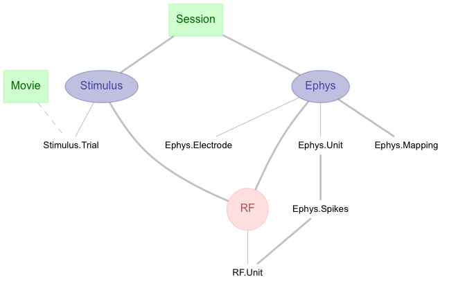
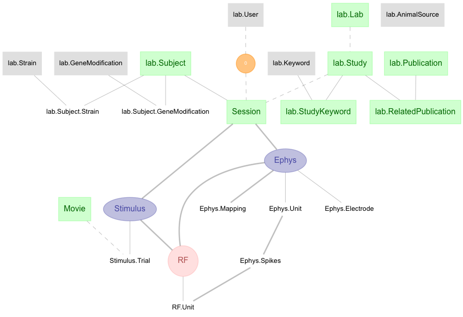

# djcat-RET-1

A pipeline for an retina electrophysiology study

This pipeline is based on the study described in:

[Lefebvre, J.L., Zhang, Y., Meister, M., Wang, X., and Sanes, J.R.
(2008) Gamma-Protocadherins regulate neuronal survival but are
dispensable for circuit formation in retina. Development 135:4141-4151.
](https://www.ncbi.nlm.nih.gov/pubmed/19029044) 

with data available from:

https://crcns.org/data-sets/retina/ret-1/about-ret-1

## RET-1 Schema

## Entire Pipeline

## Online viewing

All Jupyter notebooks in this catalog can be better viewed online through the
Jupyter.org viewer at http://nbviewer.jupyter.org/github/datajoint-catalog

## Obtain credentials

If you need a database account to try these examples, you can get a free
tutorial account by subscribing through https://datajoint.io.

Before you start working with the pipeline, please obtain the following
credentials:

* host address
* user name 
* password

# Setup

The instructions for downloading the DataJoint library are available here:

http://docs.datajoint.io/setup/Install-and-connect.html

Additionally, the common 'djcat-lab' module for general experiment data needs to
be cloned from:

    https://github.com/datajoint-catalog/djcat-lab.git

since it is referenced from this project.  Be sure to setup your PYTHONPATH
variable accordingly so that djcat-lab is included in sys.path. For example,
your djcat-lab source code is stored in the same folder as this experiment, you
can add it from within python as follows:

    >>> import sys
    >>> import os
    >>> sys.path.insert(0, os.path.join('..','djcat-lab'))

# Support

Please submit issues and questions through the [Issues tab
above](https://github.com/datajoint-catalog/RET-1/issues)
